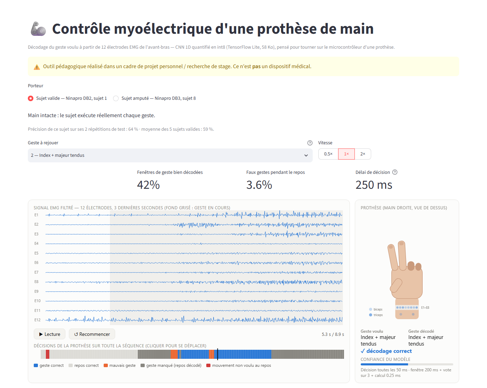
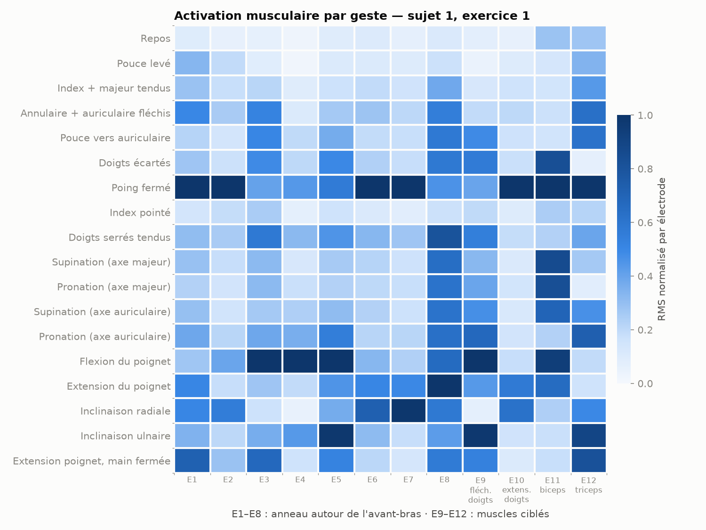
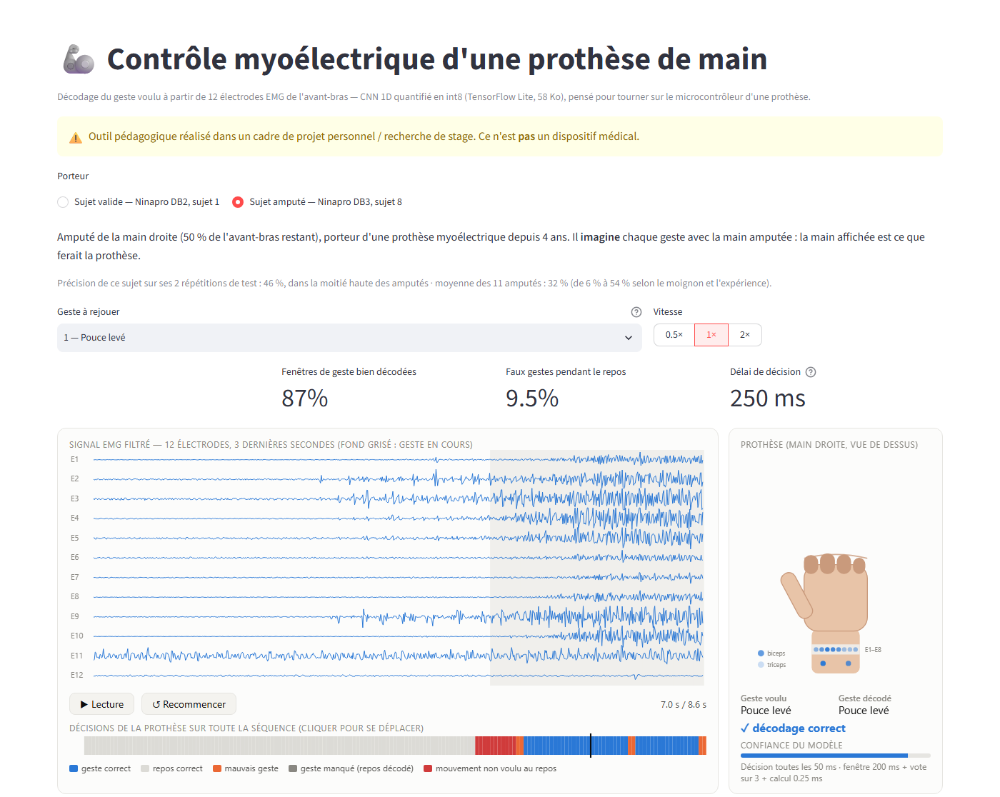

# Contrôle myoélectrique d'une prothèse de main (EMG)

Décoder le geste voulu (pince, poing fermé, index tendu…) à partir des signaux
électriques des muscles de l'avant-bras (EMG de surface), comme le fait une
prothèse de main myoélectrique — avec les contraintes d'un **objet connecté de
santé embarqué** : décision en temps réel, modèle assez léger pour tourner sur
un microcontrôleur, adaptation rapide à un nouveau porteur.

Troisième volet d'un portfolio en IA appliquée à la santé, après
[stroke-risk-predictor](../test/stroke-risk-predictor) (données tabulaires, ML
classique) et [radio_thoracique](../radio_thoracique) (images, deep learning) :
ici, **signal physiologique temporel**, avec la même démarche (pipeline complet,
interprétabilité, démo Streamlit).

⚠️ **Disclaimer** : projet pédagogique / recherche de stage. Ce n'est **pas** un
dispositif médical.



## Dataset

[Ninapro](https://ninapro.hevs.ch/) — base publique de référence pour le contrôle
myoélectrique :

- **DB2** : 40 sujets valides, 12 électrodes EMG (Delsys Trigno, 2 kHz),
  ~50 mouvements répétés 6 fois.
- **DB3** : 11 sujets **amputés transradiaux**, même protocole et même matériel.

Fichiers `S<n>_E<k>_A1.mat` à placer dans `data/raw/db2/` (et `data/raw/db3/`).
Pour économiser le disque : supprimer les `.zip` après extraction, puis convertir
en `.npz` compact (`src/data_loading.py`).

Protocole d'évaluation standard de la littérature Ninapro : répétitions
1, 3, 4, 6 pour l'entraînement, 2 et 5 pour le test.

## Exploration

Détails dans [`notebooks/01_exploration.ipynb`](notebooks/01_exploration.ipynb).
Chaque geste sollicite une combinaison d'électrodes différente — c'est ce motif
que le modèle apprend à reconnaître :



## Résultats (5 sujets DB2, exercice 1 : 17 gestes + repos)

Évaluation **en flux continu** (une décision toutes les 50 ms, transitions entre
gestes comprises), sur les répétitions 2 et 5 jamais vues à l'entraînement.
Métriques orientées porteur : accuracy équilibrée entre gestes, **faux gestes au
repos** (la prothèse bouge sans que l'utilisateur le veuille) et délai total de
décision (fenêtre 200 ms + vote + calcul, budget ~300 ms).

### Nouvel utilisateur : combien de calibration faut-il ?

Protocole *leave-one-subject-out* : chaque sujet joue le nouveau porteur, le CNN
est pré-entraîné sur les 4 autres puis ajusté avec 1, 2 ou 4 répétitions du
nouveau porteur (1 répétition ≈ 2 min 20 d'enregistrement). Post-traitement
identique pour toutes les méthodes (vote sur 3 décisions, ~250–275 ms de délai).
Moyenne ± écart-type sur les 5 sujets :

| Calibration | Méthode | Acc. équilibrée | Faux gestes au repos |
|---|---|---|---|
| aucune | CNN pré-entraîné | 17.7 ± 3.8 % | 8.6 % |
| 1 répétition | **LDA** (Hudgins) | **52.6 ± 5.6 %** | 11.4 % |
| | CNN seul | 39.8 ± 3.9 % | 4.3 % |
| | CNN pré-entraîné + ajusté | 45.5 ± 4.3 % | 7.5 % |
| 2 répétitions | LDA | 59.0 ± 4.2 % | 7.9 % |
| | CNN seul | 57.1 ± 4.4 % | 9.9 % |
| | CNN pré-entraîné + ajusté | 56.8 ± 5.7 % | **4.6 %** |
| 4 répétitions | LDA | 61.8 ± 4.3 % | 7.1 % |
| | CNN seul | 60.5 ± 8.6 % | 4.7 % |
| | **CNN pré-entraîné + ajusté** | **63.4 ± 6.3 %** | **3.8 %** |

Lecture :
- **Sans calibration, rien ne marche** (17.7 %) : les signaux EMG diffèrent trop
  d'une personne à l'autre (placement des électrodes, morphologie). Une phase de
  calibration est indispensable.
- **Calibration très courte (1 répétition) : la LDA est la plus robuste**, au prix
  de nombreux faux gestes au repos.
- **Avec 4 répétitions, le CNN pré-entraîné sur d'autres sujets donne la
  meilleure précision et divise presque par 2 les faux gestes au repos** par
  rapport à la LDA. Le pré-entraînement améliore le CNN à 1 et 4 répétitions
  (+5.7 et +2.9 points), pas à 2.
- Le gain en précision reste modeste et n'apparaît que sur 3 sujets sur 5 : avec
  5 sujets, il n'est pas statistiquement établi. Le sujet 4, le plus difficile
  pour toutes les méthodes, est aussi le seul sujet gaucher (protocole réalisé main
  droite) — hypothèse non vérifiée.

Détails : `models/transfer_summary.json` (valeurs par sujet), code dans
[`src/transfer.py`](src/transfer.py). Comparaison intra-sujet avec seuil de
confiance réglé sur validation : [`src/evaluate_stream.py`](src/evaluate_stream.py),
résumé par `python src/summarize.py`.

### Embarqué : export TensorFlow Lite

Export des CNN intra-sujet ([`src/export_tflite.py`](src/export_tflite.py)),
moyenne sur 5 sujets, flux continu avec vote sur 3 :

| Format | Taille | Acc. équilibrée | Accord avec Keras | Calcul / décision (PC) |
|---|---|---|---|---|
| float32 | 188 Ko | 60.8 % | 100 % | 0.18 ms |
| poids int8 | 56 Ko | 60.9 % | ≥ 99.6 % | 0.50 ms |
| **int8 complet** | **58 Ko** | 59.8 % | ≥ 97.9 % | 0.24 ms |

- **5.2 M multiplications-accumulations par décision**, soit ~100 M/s au rythme
  d'une décision toutes les 50 ms. La latence sur microcontrôleur n'a pas été
  mesurée (pas de carte) : c'est la prochaine vérification à faire sur cible.
- Piège rencontré : quantifier en int8 le signal brut (en volts, très dynamique)
  écrase les petites amplitudes à zéro et le modèle tombe au niveau du hasard
  (5.6 %). Solution : normalisation par électrode faite avant le réseau
  (12 opérations par échantillon) + écrêtage à ±8 écarts-types.

### Sujets amputés (DB3)

Mêmes analyses sur les **11 sujets amputés transradiaux** de Ninapro DB3, qui
*imaginent* faire les gestes avec la main amputée. Particularités : S6 et S7
n'ont que 10 électrodes (pas de place sur le moignon), S7 n'a plus d'avant-bras
(signaux au niveau du bruit), l'électrode 7 de S3 semble défectueuse. Aucun
sujet n'a été écarté.

**Valides vs amputés, même protocole** (moyenne ± écart-type) :

| | Valides (DB2, 5 sujets) | Amputés (DB3, 11 sujets) |
|---|---|---|
| Intra-sujet, LDA | 59.1 ± 5.0 % | 32.6 ± 15.9 % |
| Intra-sujet, CNN | 59.3 ± 8.5 % | 32.3 ± 16.5 % |
| Nouveau porteur, 4 rép., LDA | 61.8 ± 4.3 % | **41.4 ± 11.9 %** |
| Nouveau porteur, 4 rép., CNN pré-entraîné | **63.4 ± 6.3 %** | 36.3 ± 12.8 % |
| Nouveau porteur, sans calibration | 17.7 % | 9.9 % (hasard : 5.6 %) |

*(intra-sujet : seuil de confiance réglé sur validation ; nouveau porteur : vote
fixe sans seuil — d'où des valeurs différentes pour la même LDA)*

**Nouveau porteur amputé** (pré-entraînement sur les 10 autres amputés) :

| Calibration | Méthode | Acc. équilibrée | Faux gestes au repos |
|---|---|---|---|
| 1 répétition | **LDA** | **29.6 ± 10.2 %** | 26.3 % |
| | CNN pré-entraîné + ajusté | 24.4 ± 9.1 % | 14.6 % |
| 2 répétitions | **LDA** | **37.0 ± 10.8 %** | 23.6 % |
| | CNN pré-entraîné + ajusté | 30.3 ± 11.4 % | **10.0 %** |
| 4 répétitions | **LDA** | **41.4 ± 11.9 %** | 21.4 % |
| | CNN seul | 37.1 ± 13.9 % | 30.0 % |
| | CNN pré-entraîné + ajusté | 36.3 ± 12.8 % | **11.3 %** |

Lecture :
- **L'écart valides / amputés est massif** : la précision est divisée par ~2 et
  varie énormément d'un amputé à l'autre (de 9 % à 55 %). Les conclusions tirées
  sur sujets valides ne se transposent pas telles quelles.
- **Chez les amputés, la LDA classique reste la plus précise** à tous les
  budgets de calibration. Le pré-entraînement sur d'autres amputés n'améliore pas
  la précision du CNN : chaque moignon est trop différent des autres.
- **Le CNN pré-entraîné garde un avantage net sur les mouvements non voulus** :
  environ 2 fois moins de faux gestes au repos que la LDA (11 % contre 21 %).
  Sans seuil de confiance, la LDA déclenche un geste sur 5 fenêtres de repos,
  inacceptable pour un porteur ; avec un seuil réglé (intra-sujet), elle descend
  à 6.4 %.
- **Observation (5 + 5 sujets, corrélation seulement)** : les amputés qui
  utilisent déjà une prothèse myoélectrique (S1, S3, S8, S9, S11) obtiennent
  44.8 % en moyenne (LDA intra-sujet), contre 25.2 % pour ceux qui n'en ont
  jamais utilisé (S2, S4, S5, S6, S10). S7, utilisateur mais sans avant-bras,
  est exclu de cette comparaison. Hypothèse : l'habitude de produire des
  contractions distinctes compte autant que l'algorithme. La longueur du moignon
  restant n'explique pas à elle seule les écarts (S5 : 90 % d'avant-bras, 20 %).

Protocole de pré-entraînement allégé pour DB3 (10 sujets, contrainte de 6 Go de
RAM) : fenêtres toutes les 100 ms, 15 époques maximum, fenêtres découpées à la
volée. Résultats : `models/db3/`, commandes avec `--db db3`.

### Limites

- 5 sujets valides et 11 amputés, un seul entraînement par configuration (pas de
  répétition sur plusieurs graines aléatoires).
- Réglages (seuil, nombre d'époques) choisis sur une seule répétition de
  validation : peu fiable sur certains sujets. Le poids de la classe repos,
  choisi sur un sujet valide, a été appliqué tel quel aux amputés.
- Protocoles de pré-entraînement différents entre DB2 (4 sujets) et DB3
  (10 sujets, allégé) : la comparaison du transfert est indicative.
- Gestes imaginés en laboratoire, bras immobile, sans retour visuel d'une vraie
  main : en conditions réelles, le porteur s'adapte au contrôleur.

## Dossier « dispositif médical » et tests

Exercice appliquant la démarche d'un fabricant de dispositif médical, dans
[`docs/dispositif-medical/`](docs/dispositif-medical/README.md) : usage prévu et
statut réglementaire (MDR, IEC 62304), **analyse des risques** inspirée d'ISO 14971
et **matrice de traçabilité** exigences → tests → résultats, générée
automatiquement.

L'analyse a révélé un défaut de sécurité : face à une électrode saturée ou à un
bruit fort, le réseau déclenchait un geste avec jusqu'à 99 % de confiance. Un
contrôle de qualité du signal ([`src/signal_quality.py`](src/signal_quality.py))
force désormais le repos (0,007 % de fausses alarmes sur signaux réels).

```bash
python -m pytest tests            # 15 tests automatisés
python src/verification_report.py # régénère la matrice de traçabilité
```

## Démo

Application Streamlit qui rejoue un enregistrement réel (répétition 2, jamais vue
à l'entraînement) comme le ferait la prothèse : une fenêtre de 200 ms toutes les
50 ms, décodée par le modèle **int8** de 58 Ko du porteur. Deux porteurs au choix :
un **sujet valide** (DB2, sujet 1) et un **sujet amputé** (DB3, sujet 8 : 50 %
d'avant-bras restant, porteur d'une prothèse myoélectrique depuis 4 ans, situé
dans la moitié haute des amputés — la page rappelle la moyenne du groupe). On y voit le signal
des 12 électrodes défiler, une main qui prend la pose du geste décodé, les
électrodes qui s'allument selon l'activité musculaire, et une frise des
décisions (gestes corrects, mauvais gestes, mouvements non voulus au repos).

```bash
streamlit run app/streamlit_app.py
```

Chez le sujet amputé, les signaux sont plus faibles et la frise des décisions montre
davantage d'erreurs, notamment des mouvements non voulus (rouge) juste avant le geste :



Lien direct vers un cas précis : `?porteur=db3_s8&geste=1&t=7&pause=1`
(porteur, geste 1–17, instant en secondes, lecture en pause).

Les fichiers de la démo (extraits de ~145 s, modèles int8) se régénèrent avec
`python src/make_demo_data.py --subject 1` et
`python src/make_demo_data.py --subject 8 --db db3` (après
`python src/export_tflite.py --subjects 8 --db db3`).

## Démarche prévue

1. **Exploration** — visualisation des signaux par électrode et par geste.
2. **Prétraitement** — filtrage passe-bande 20–450 Hz + coupe-bande 50 Hz,
   fenêtres glissantes de 200 ms (pas de 50 ms).
3. **Baseline « prothèse réelle »** — features temporelles de Hudgins
   (MAV, RMS, WL, ZC, SSC) + LDA : l'approche historique des prothèses
   commerciales.
4. **Deep learning** — CNN 1D sur les fenêtres brutes, comparé à la baseline.
5. **Contraintes objet connecté** ✅
   - latence de décision (fenêtre + inférence) < 300 ms ;
   - export TensorFlow Lite quantifié int8, taille mémoire compatible
     microcontrôleur ;
   - nouvel utilisateur : modèle pré-entraîné sur d'autres sujets, recalibré
     avec quelques secondes de données.
6. **Valides vs amputés** — écart de performance DB2 / DB3. ✅
7. **Interprétabilité** — contribution de chaque électrode (muscle) par geste.
8. **Démo** ✅ — signal EMG rejoué en flux + main animée exécutant le geste prédit.

## Structure

```
data/raw/        données Ninapro (non versionnées)
data/processed/  fenêtres / features compactes (.npz)
notebooks/       exploration
src/             chargement, prétraitement, features, entraînement
models/          modèles entraînés
app/             démo Streamlit
docs/            figures
```

## Installation

Le projet réutilise l'environnement de `radio_thoracique` (TensorFlow,
scikit-learn, SciPy, Streamlit déjà installés) pour économiser l'espace disque :

```bash
../radio_thoracique/venv/Scripts/activate
```

Sinon : `python -m venv venv && pip install -r requirements.txt`.

## Données et licence

- **Source** : base [Ninapro](https://ninapro.hevs.ch/), jeux DB2 (sujets valides)
  et DB3 (sujets amputés), fichiers téléchargés sur le site Ninapro.
- **Licence** : les données sont également déposées par leurs auteurs sur
  [Dryad](https://doi.org/10.5061/dryad.1k84r) sous licence
  [CC0 1.0 (domaine public)](https://creativecommons.org/publicdomain/zero/1.0/),
  qui autorise leur réutilisation et leur redistribution. Le site Ninapro
  n'indique pas de licence propre et demande de citer l'article ci-dessous. Pour
  certains sujets DB3, la version du site Ninapro diffère de celle de Dryad ; les
  fichiers utilisés par la démo (DB2 sujet 1, DB3 sujet 8) ont la même taille
  dans les deux dépôts.
- **Ce qui est redistribué ici** : uniquement deux extraits filtrés utilisés par la
  démo (`app/demo_data/`, répétition 2 de l'exercice 1 de DB2 sujet 1 et DB3
  sujet 8, ~13 Mo au total). Les données complètes ne sont pas versionnées : les
  télécharger depuis le site Ninapro ou Dryad (voir [Dataset](#dataset)).
- **Anonymat** : données publiées pseudonymisées par leurs auteurs (numéro de
  sujet, caractéristiques générales) ; aucune donnée personnelle ajoutée ici.

### Référence à citer

Atzori M., Gijsberts A., Castellini C., Caputo B., Hager A.-G. M., Elsig S.,
Giatsidis G., Bassetto F., Müller H. (2014). *Electromyography data for
non-invasive naturally-controlled robotic hand prostheses*. Scientific Data 1,
140053. https://doi.org/10.1038/sdata.2014.53
